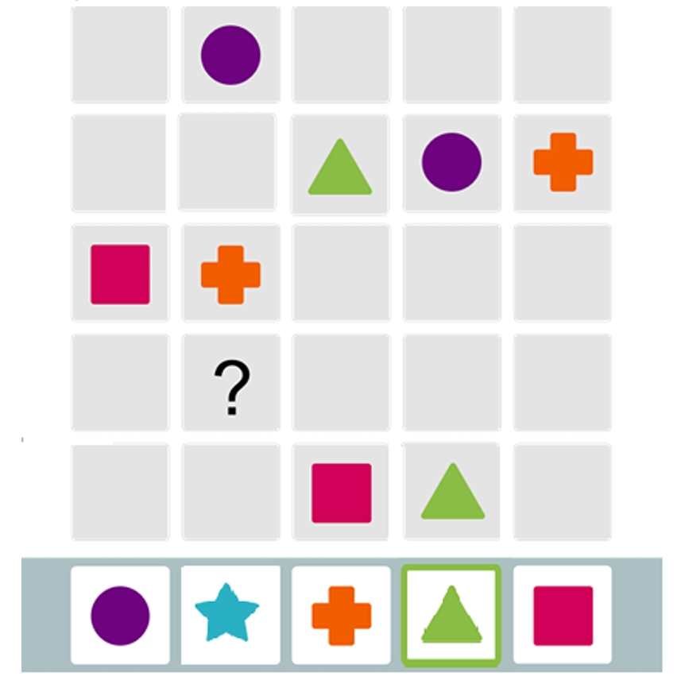
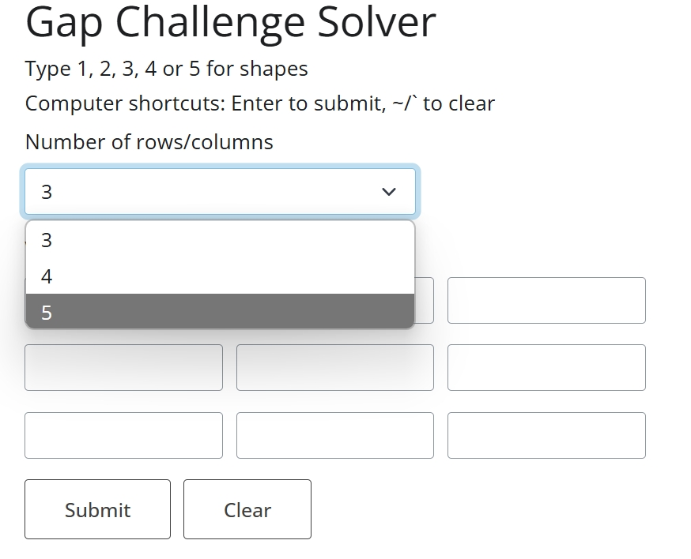
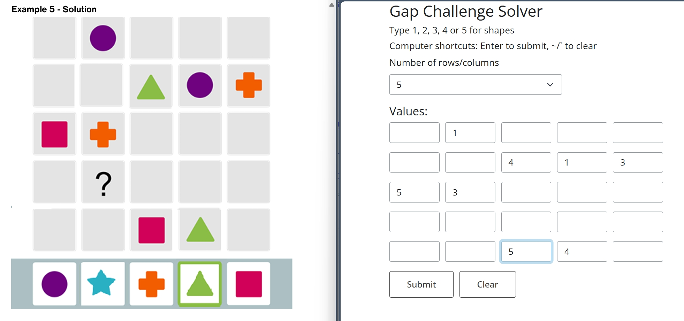
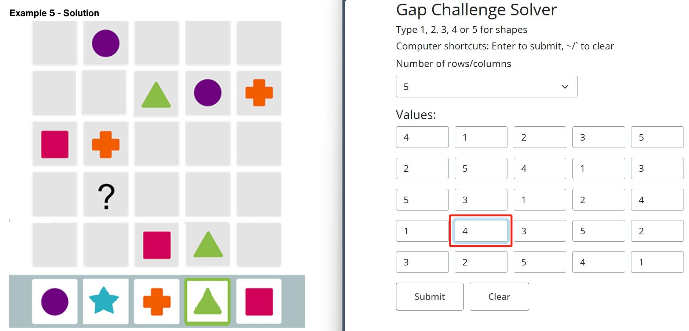

# How to use the gap challenge solver

Go to [https://rubuky.com/tool/2024-11-02-GapChallenge/](https://rubuky.com/tool/2024-11-02-GapChallenge/) for an online usage.

Please  give me a star🌟 leave a comment below on my [webpage](https://rubuky.com/tool/2024-11-02-GapChallenge/) if you find this useful.

Let's use the most difficult level 5 as an example:

We first change the number of rows and columns of the solver to "5":

We then enter the existing patterns using numbers:

Then hit `Enter` (if you are using a computer) or press the `Submit` button. If the problem is entered correctly, a full solution will be displayed:

In this case, `4`, which corresponds to the green trigangle, is the answer we are looking for.

In the end, we can hit `` ~/` `` if on a computer, or hit `Clear` to clear the problem and move on to the next one.